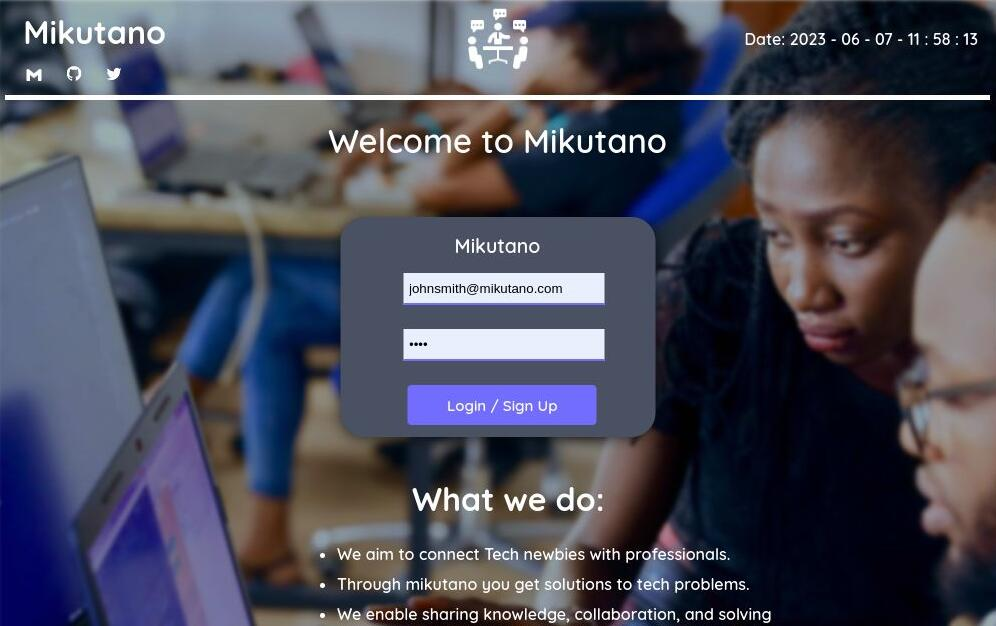
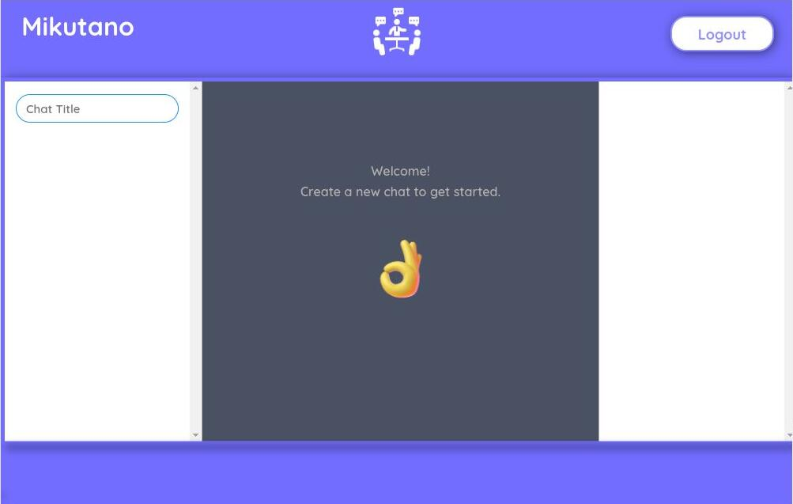
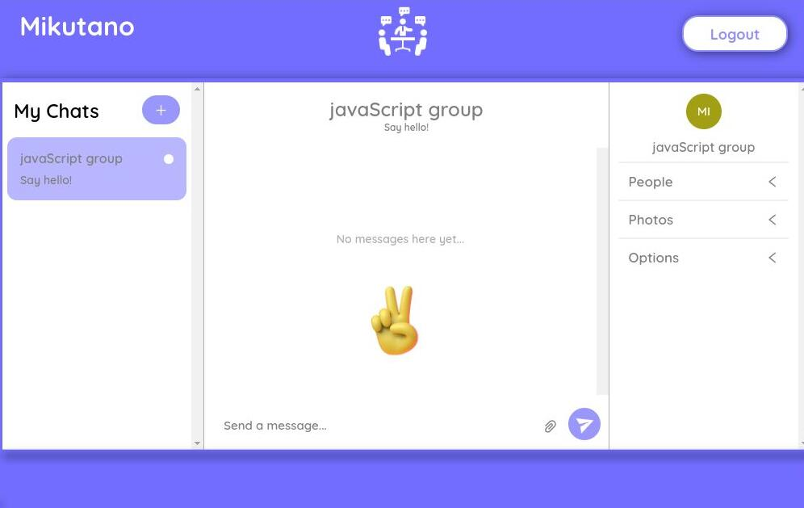

# Mikutano

Mikutano is a chatting application designed to connect software engineering students to professionals.

## Installation

To install Mikutano, follow these steps:
<br><span>NOTE:<span> all of the following steps are to be perfomed in the repository.
1. Clone the repository:
   ```bash
   git clone https://github.com/wantonraven/mikutano.git
   ```
2. Clean the Yarn cache
   ```bash
   yarn cache clean
   ```
3. Remove the existing node_modules directory
   ```bash
   rm -rf node_modules
   ```
4. Install the project dependencies
   ```bash
   yarn install
   ```
5. Build the project
   ```bash
   yarn run build
   ```
6. Start Mikutano
   ```bash
   yarn start
   ```
# Usage
1. From the main page click `get started` to get in the login page.
  
2. `Login or sign up` if you don't have an account.
  
3. Click on the bar(`Chat Title`) in the top left corner and type name of chat room of your wish to create a chat room and start a conversation.
  
4. If you want to chat with someone specific, click on the "People" button in the right middle section, search for their name, and start a conversation with them.

# Technologies Used
- React
- Next.js
- Node.js
- ChatEngine
  
# Contributing
  If you would like to contribute to Mikutano, please reach out before making any changes to discuss the potential contributions.
 
# Contact
  
  ## 1. Joseph Kakai 
- Twitter: [wantonraven](https://twitter.com/wantonraven)
- LinkedIn: [Joseph Kakai](https://www.linkedin.com/in/joseph-kakai-041a96140/)
- Gmail: [wanton raven](mailto:josephngalu96@gmail.com)
  
  ## 2. Purity Chege
- Twitter: [Purity Chege](https://twitter.com/Khai_Purity01)
- LinkedIn: [Purity chege](https://www.linkedin.com/in/purity-chege-99302b22b/)
- Gmail: [Purity Chege](mailto:shishchei@gmail.com)
  
  ## 3. Oluwatosin Orenaike
- Twitter: [Oluwatosin Orenaike](https://twitter.com/otomisin)
- LinkedIn: [Oluwatosin Orenaike](https://www.linkedin.com/in/otomisin/)
- Gmail: [Oluwatosin Orenaike](mailto:orenaiket@yahoo.com)
  
# License
  Mikutano is released under an open-source license.
